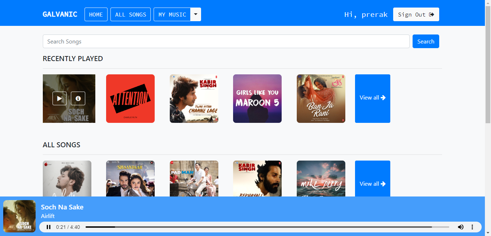
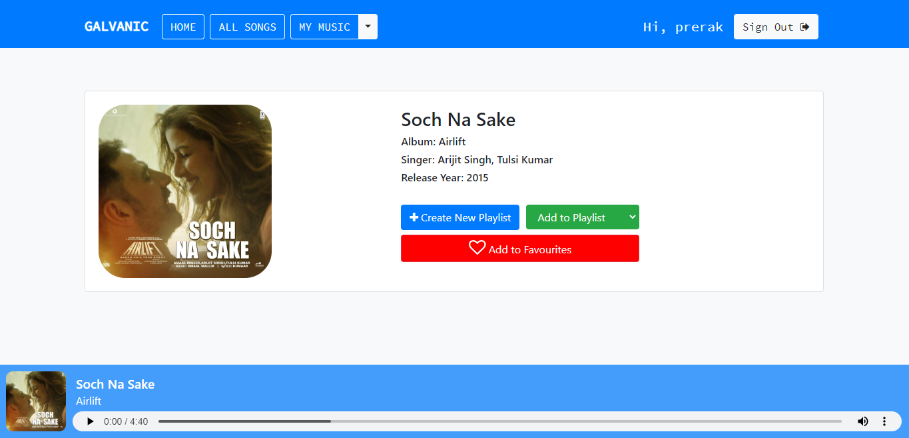

# 🎵 Music Hub - Django Music Streaming Application

A feature-rich, interactive music streaming web application built with **Django**, **Bootstrap**, and **SQLite**.

[](https://github.com/Parth-262/Music-Hub)
[](https://github.com/Parth-262/Music-Hub)
[](./LICENSE)

---

## 📸 Website Preview

### Home Page


### Detail Page


---

## 📋 Features

⚡️ **User Authentication**: Sign Up, Sign In, and Logout functionality.\
⚡️ **Google OAuth**: Google Sign Up and Sign In integration.\
⚡️ **Music Player**: Play songs with audio visualization and view detailed song information.\
⚡️ **Search & Filter**: Search songs easily and filter by language (*Hindi*, *English*) or artist.\
⚡️ **Personalized Playlists**: Create, update, and manage custom playlists.\
⚡️ **Favourites**: Bookmark your favorite tracks for quick access.\
⚡️ **Recently Played**: Automatically logs and displays your recently played songs.

---

## 📦 Installation & Local Setup

### 1. Clone the repository
```shell
git clone https://github.com/Parth-262/Music-Hub.git
cd Music-Hub
```

### 2. Install dependencies
```shell
pip install -r requirements.txt
```

### 3. Run database migrations
```shell
python manage.py migrate
```

### 4. Start the server
```shell
python manage.py runserver
```

> Open [http://127.0.0.1:8000/](http://127.0.0.1:8000/) in your browser.

---

## 👨‍💻 Developer & Author ✨

| <a href="https://github.com/Parth-262" target="_blank">**Parth**</a> |
| :---: |
| [](https://github.com/Parth-262) |
| <a href="https://github.com/Parth-262" target="_blank">`github.com/Parth-262`</a> |

---

## 📄 License

This project is licensed under the MIT License - see the [LICENSE](./LICENSE) file for details.
